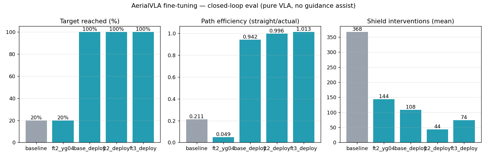
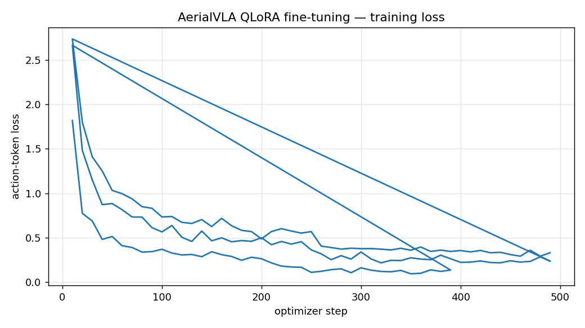

# AerialVLA Fine-Tuning Report — 2026-07-17

Base: openvla-7b (4-bit NF4) + AerialVLA LoRA (r=64), fine-tuned with QLoRA on self-collected AirSimNH expert flights (front+down mosaic, semantic-direction prompt, 99-bin action text).

## Closed-loop evaluation (pure VLA — goal assist OFF)

| adapter | episodes | reached | mean efficiency | mean interventions | NFZ s |
|---|---|---|---|---|---|
| baseline | 5 | 20% | 0.211 | 367.6 | 0.0 |
| ft2_yg04 | 5 | 20% | 0.049 | 144.2 | 0.0 |
| base_deploy | 5 | 100% | 0.942 | 108.0 | 0.0 |
| ft2_deploy | 5 | 100% | 0.996 | 43.6 | 0.0 |
| ft3_deploy | 5 | 100% | 1.013 | 73.8 | 0.0 |

## Training loss

## Notes
- Eval flights are PURE VLA (`--goal-blend 0`): the score measures the
  model itself; the tuned guidance assist would raise all variants further.
- NFZ safety is the guardrail's job in every configuration (P0 escape = 0
  regardless of the model in the slot).